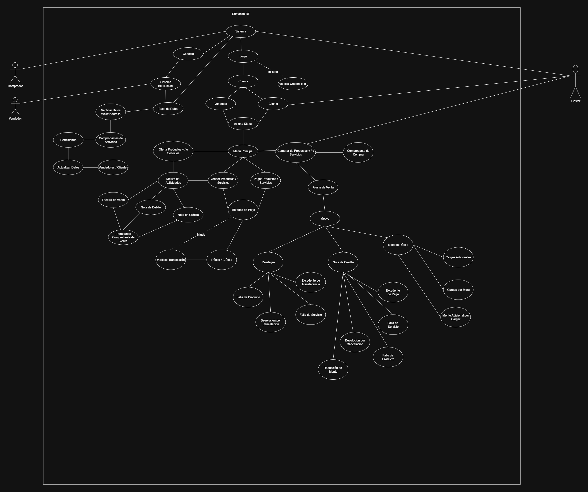
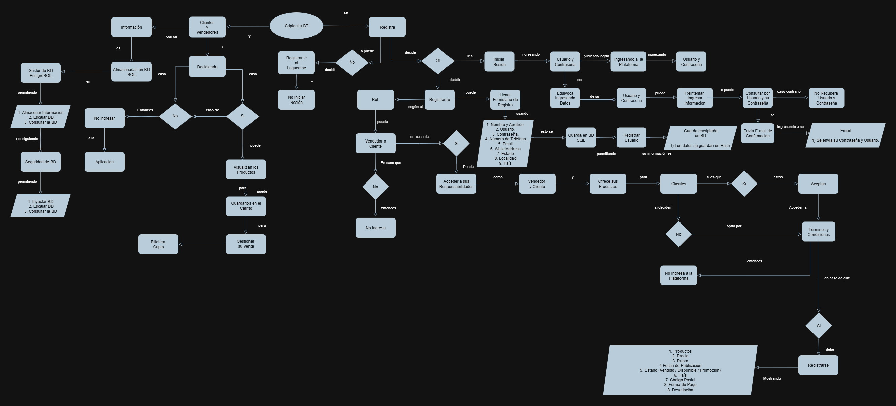
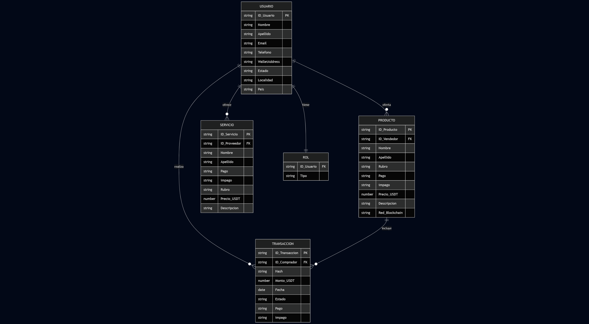

# Documentación Técnica – Arquitectura del Sistema: Pool Pay

---

## Índice
1. [Introducción](#1-introducción)
2. [Objetivos del Sistema](#2-objetivos-del-sistema)
3. [Estructura del Proyecto](#3-estructura-del-proyecto)
4. [Respaldo de Datos](#4-respaldo-de-datos)
5. [Componentes Principales](#5-componentes-principales)
    - [5.1 Módulo de Usuarios](#51-módulo-de-usuarios)
    - [5.2 Backend](#52-backend)
    - [5.3 Frontend](#53-frontend)
    - [5.4 Base de Datos](#54-base-de-datos)
    - [5.5 Notificaciones y Alertas](#55-notificaciones-y-alertas)
6. [Diagramas del Sistema](#6-diagramas-del-sistema)
    - [6.1 Diagrama de Componentes](#61-diagrama-de-componentes)
    - [6.2 Diagramas UML / Flujo / ER](#62-diagramas-uml--flujo--er)
7. [Pruebas del Sistema](#7-pruebas-del-sistema)
8. [Herramientas y Buenas Prácticas](#8-herramientas-y-buenas-prácticas)

---

## 1. Introducción

Pool Pay es un sistema que permite conectar compradores con proveedores de bienes y servicios, respetando criterios como precio, cantidad, fecha de entrega, y calidad.  
Basado en las historias de usuario, busca optimizar el flujo de contacto entre ambas partes con envío de propuestas automáticas en PDF y por email.

`TODO: Agregar visión técnica resumida del sistema.`

---

## 2. Objetivos del Sistema

- Permitir a los compradores registrar pedidos con criterios claros.
- Permitir a los proveedores cargar sus productos/servicios.
- Filtrar automáticamente las mejores coincidencias y enviar por correo al comprador.
- Permitir contacto entre las partes sin intermediarios.
- Generar reportes en PDF claros y ordenados.

`TODO: Agregar otros objetivos técnicos y de negocio.`

---

## 3. Estructura del Proyecto

`TODO: Actualizar según la estructura real del proyecto.`

---

## 4. Respaldo de Datos

- Frecuencia de backups: diaria/semanal
- Base de datos utilizada: MySQL
- Cifrado: `TODO: especificar si se aplica`
- Ubicación de los backups: `TODO: indicar`

---

## 5. Componentes Principales

### 5.1 Módulo de Usuarios

- Registro por N° de CUIL y Email
- Roles diferenciados: Cliente / Proveedor
- Estado de cuenta, validaciones

`TODO: Agregar autenticación, permisos.`

---

### 5.2 Backend

- Framework: Django
- Generación de PDF con propuestas
- Envío de correo con Gmail API
- Algoritmo de filtrado (rubro, calidad, precio, fecha, stock)

---

### 5.3 Frontend

- HTML5, Bootstrap
- Formularios adaptables según rol
- Vista responsiva sin JavaScript (mínimo uso)

---

### 5.4 Base de Datos

- MySQL
- Tablas:
  - Usuario
  - Producto
  - Pedido
  - Propuesta
  - Historial

`TODO: Incluir DER final cuando esté disponible.`

---

### 5.5 Notificaciones y Alertas

- Gmail API para notificación al cliente
- Copia a administrador
- Confirmación de envío exitosa o fallida

---

## 6. Diagramas del Sistema

### 6.1 Diagramas UML / Flujo / ER

- Diagrama de flujo de usuario (cliente y proveedor)
- Diagrama de entidad relación (MySQL)
- Casos de uso en UML
#### Diagrama UML

#### Diagrama de Flujo

#### Diagrama de Entidad Relacion

---

## 7. Pruebas del Sistema

- Pruebas con Caso de Uso con Usuarios Filmado con ODS y Documentada la conversación con Notion.
- Pruebas funcionales de carga de productos y solicitudes.
- Validación del PDF y envío por correo.

---

## 8. Herramientas y Buenas Prácticas

### 8.1 Control de Versiones

- Git + GitHub  
- Branches: main, dev, features/*

---

### 8.2 Entorno y Contenerización

- Si se usa Docker por simplicidad del entorno
---

### 8.3 Documentación Técnica

- Markdown en GitHub
- Diagramas con Mermaid/Miro
- Manual para desarrolladores y usuarios finales (en proceso)

---

**Fin del Documento**
